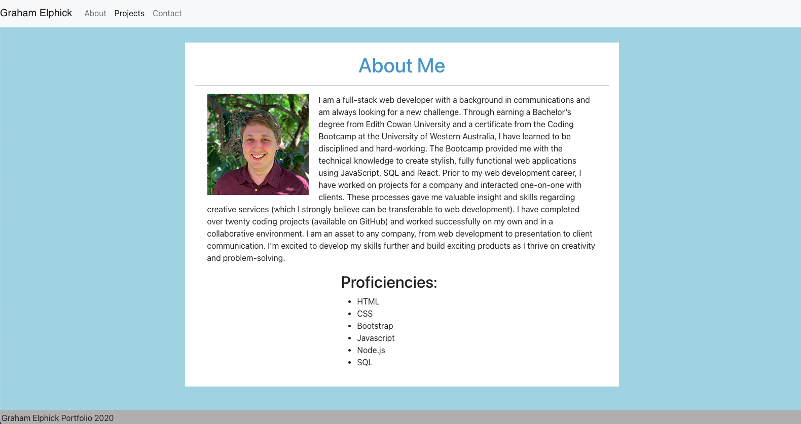
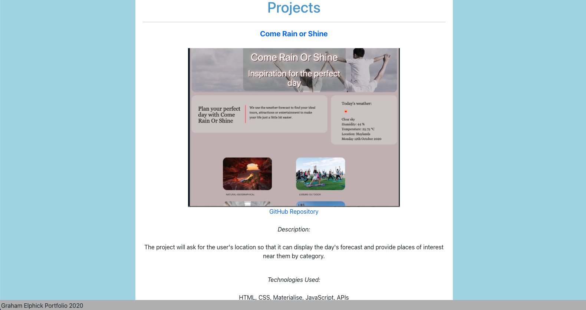
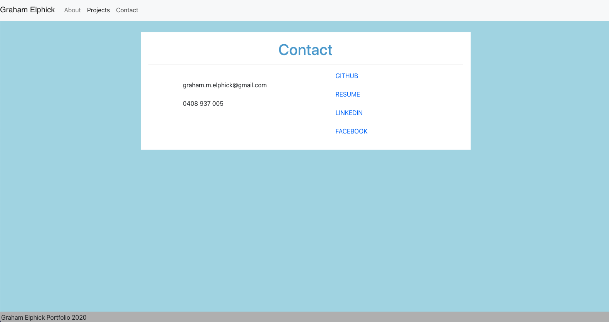

# React Portfolio

## Table of Contents
* [Description](#description)

* [Screenshots](#screenshots)

* [Installation](#installation)

* [Usage](#usage)

* [License](#license)

* [Questions](#questions)

## Description
An online portfolio containing Graham Elphick's work and contact information, built using React.

## Screenshots

## Installation
npm install

## Usage
Clone repository, npm install, npm start.

OR

Run deployed app.

## License
This application is covered under the MIT license.

## Questions
My GitHub: https://github.com/grahamelphick

If you have any further questions, you can reach me at: 